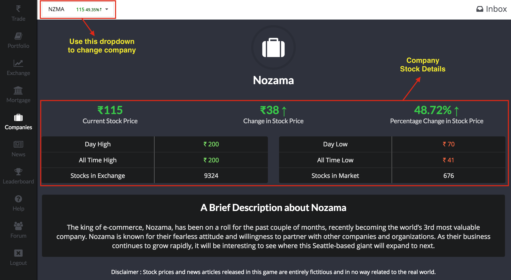
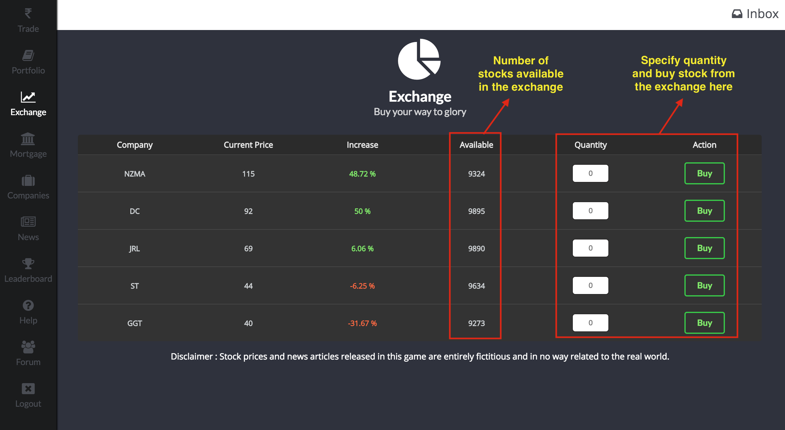
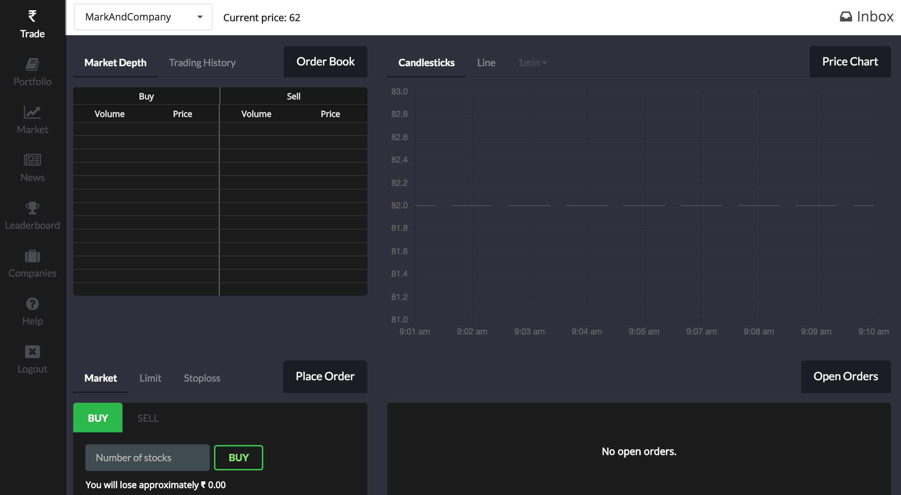
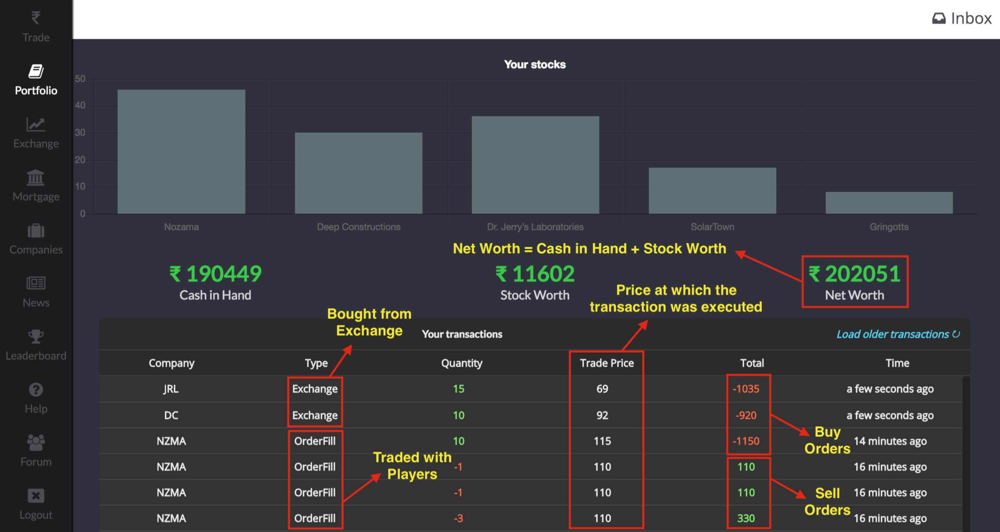

# Help
Welcome to Dalal Street! We know that there's a lot to take in, so we've prepared this help page to get you started and to answer some FAQs as well.

### Getting Started

##### The Objective
Each player begins the game with ₹20,000. Your objective is to use this money to maximise your profit at the end of 7 days.

##### How do I make money?
These are the two ways to make money :-
- Buying stocks at low prices and selling them at higher prices.
- Short selling stocks and then buying them back for a lower price.

Please note that you can only place orders when the market is open (8PM-12AM IST).

*If you're unsure of what short selling means, check out our FAQ section.*

##### The Basics
There are a total of 5 companies trading publicly on the Dalal Street Exchange. To know more about each company, check out the **Companies Page**, which is shown in the image below. On this page, you'll find a short description about each company as well as its latest stock price information.

Please note that the companies on the Dalal Street Exchange are **in no way related to their real world counterparts**. The stock prices and news articles released in this game are entirely fictitious and will NOT be affected by real world events.

Before the game begins, all stocks will be held by the exchange. As soon as the market opens on Day 1, the stocks will be open for all of the players to buy. Buying stocks from the exchange can be done from the **Exchange Page**, as shown below. This page also displays the number of stocks available in the *exchange*.

We also recommend that you pay close attention to the **News Page**. This page will constantly be updated with articles about company news, scandals, rumours, or even political developments. You will receive a notification in your inbox every time a new story is published, as well as a notification on your phone if you're using the Dalal Street Android App. Staying connected with story developments could give you an edge over other players as this is the best way to predict the future performance of a company.

##### Buying and Selling Stocks
All trading related tasks are performed on the **Trading Page**, which is shown in the image below. 

Lets walk through all the elements of this page.

**At the top of the page** is a dropdown you can use to select which company's trading information is displayed.

**On the top left is the Order Book** - The Market Depth lists all *open* buy and sell orders. This includes orders issued by *all players*. By observing the Market Depth, you can see the prices at which other players are placing the orders and judge the current mood of the market. The Trading History displays all the transactions that have been executed for the company you've chosen.

**On the bottom left is where you place your orders** - There are 3 different types of orders you can place - Market, Limit and Stoploss. If you're unsure of what these terms mean, check out our FAQ section at the bottom of this page.

Once your orders are placed, we will match the order based on a *best match* algorithm and you will receive a notification once your order has been filled.

**On the bottom right is a list of all your open orders** - These are the orders that you have placed but have not been filled yet. After you place an order, the order will appear here until it is successfully filled.

**On the top right is the Price Chart** - This shows how the stock price of the selected company has changed over time. You can analyse the data with different time intervals by using the dropdown above the chart.

Once you've bought some stocks, you can check all the stocks you own as well as your *Net Worth* on the **Portfolios Page**, as shown in the image below. This page will also give you a list of all your executed transactions.

Hopefully, this should be enough to get you going and start trading! If you still have some questions, please read our FAQ section below where we address some more common doubts that players may have.

### FAQs

##### What is this short selling you speak of?
While you will *buy* a company's stock if you expect its price to go up, you can *short sell* a company's stock if you expect its price to go down. In a nutshell, short selling means to sell stocks that you don't own.

As an example, short selling 5 shares of company XYZ is mathematically equivalent to buying -5 shares of XYZ. As a result, your *Cash In Hand* will increase and your *Stock Worth* will accordingly decrease such that your ***Net Worth* remains the same** *(Remember: Net Worth = Cash In Hand + Stock Worth)*. 

After you short sell a company, if the stock price dips below the price you sold it for, then you will have made a profit and vice-versa.

*Note : You can only short sell a maximum of 50 stocks per company*

##### What is my Net Worth and how is it calculated?
The player with the highest Net Worth at the end of 7 days is the winner. Your Net Worth is split into two parts - *Cash In Hand* and *Stock Worth*. You can see  these values, along with your trading history on the **Portfolio page**. Here's a table explaining how your Net Worth will change in response to different events :-

| Event | Cash In Hand | Stock Worth | Net Worth
| ------ | ------ |-|-|
| Buy stocks | Decreases | Increases | Constant
| Sell stocks | Increases | Decreases | Constant
| Stock price rises | Constant | Increases | Increases
| Stock price falls | Constant | Decreases | Decreases

##### What is the difference between *Stocks in Market* and *Stocks in Exchange*?
In the **Companies Page**, you'll find an entry for Stocks in Market as well as an entry for Stocks in Exchange. Let's clarify the difference between the two. *Stocks in Exchange* refers to the number of stocks that the Dalal Street Exchange currently holds. This number will be the same as the number found under *Available* in the **Exchange Page**.

*Stocks in Market* refers to the number of stocks that are currently held by all of the players in the game. When the game begins, the *Stocks in Market* will be **0** since all stocks are initially held by the exchange. As soon as the market opens on Day 1 and players begin buying from the exchange, the number of *Stocks in Market* will increase and the number of *Stocks in Exchange* will decrease until it hits zero.

##### What does it mean if there are no stocks available in the exchange?
You can see the number of stocks available in the exchange on the **Exchange Page**. If this number is zero, it means that all shares of this company are currently in the hands of the players. Therefore, you can no longer buy shares from the exchange and instead, you'll have to place Buy Orders on the **Trading Page** to buy any stock.

##### Help! I don't know what Market, Limit and Stoploss orders are!
These are the 3 types of orders that you can place. The type of order you select can change the trade price as well as the speed at which your transaction is carried out.

1. *Market Orders*: If your primary concern is to have your order filled ASAP, and you're not too worried about the price at which the transaction is carried out, you should use a Market Order. However, make sure that *you keep an eye on the Market Depth* before issuing one of these transactions to ensure that you don't get ripped off!
 
**How it Works**: A Market *Buy* Order will find the best matching Sell Order for the same company, and execute the transaction. Similarly, a Market *Sell* Order will find the best matching Buy Order for the same company, and execute the transaction.

2. *Limit Orders*: Limit Orders allow you to specify a *maximum* trade price in case of a Limit Buy, and a *minimum* trade price in case of a Limit Sell. 

**How it Works**: A Limit *Buy* Order will find the best matching Sell Order whose trade price is *below* the limit that you have specified, and execute the transaction. Similary, A Limit *Sell* Order will find the best matching Buy Order whose trade price is *above* the limit that you have specified, and execute the transaction. 

3. *Stoploss Orders*: Stopless Buy Orders are used to jump on a rising trend and Stoploss Sell Orders are used to lock in a profit/limit your losses. 

**How it Works**: Stoploss orders are converted to Market Orders once the price crosses the Stoploss price that you set. In case of a Stoploss *Buy*, your order will be converted to a *Market Buy* as soon as the stock's price rises *above* the Stoploss price that you set. Similarly, in case of a Stoploss *Sell*, your order will be converted to a *Market Sell* as soon as the stock's price falls *below* the Stoploss price that you set.

##### What exactly is this *Trade Price* and how is it determined?
If you want to buy stocks of a certain company, there should also be a player willing to sell stocks of the same company. Our algorithm uses a best match approach to determine at what price this transaction should be carried out. This price is called the *Trade Price.* You can view the trade price of all of your executed transactions on the **Portfolio Page**.

##### Can I expect any new companies to pop up over the course of the game?
While we don't expect any more companies to go public over the course of this game, existing companies may release more shares in the middle. If this happens, then the number of *Stocks in Exchange* will increase, and you can buy these stocks from the **Exchange Page**. Stay tuned to the **News Page** to be the first to know when to expect more shares.

If you still have any queries, please feel free to ask it on our [Official Forum](http://i0.kym-cdn.com/entries/icons/facebook/000/019/615/120_-_benis.jpg) and we'll try to get back to you as soon as possible. Happy Trading!
